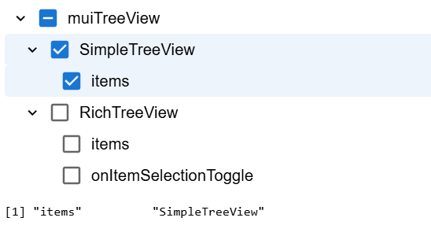

<!-- README.md is generated from README.Rmd. Please edit that file -->

```{r, include = FALSE}
knitr::opts_chunk$set(
  collapse = TRUE,
  comment = "#>",
  fig.path = "man/figures/README-",
  out.width = "100%"
)
```

# muiTreeView

<!-- badges: start -->
```{r message=FALSE, warning=FALSE, include=FALSE}
# get JS dependencies
dependencies <- jsonlite::fromJSON("js/package.json")$dependencies
```

[](https://CRAN.R-project.org/package=muiTreeView)
[](https://github.com/lgnbhl/muiTreeView/actions/workflows/R-CMD-check.yaml)
`r badger::badge_custom(names(dependencies)[4], dependencies[4], "blue", "https://mui.com/x/react-tree-view/")`
`r badger::badge_custom(names(dependencies)[5], dependencies[5], "blue", "https://mui.com/x/react-tree-view/")`
[](https://www.linkedin.com/in/FelixLuginbuhl)
<!-- badges: end -->

**muiTreeView** gives access to [MUI X Tree View](https://mui.com/x/react-tree-view/) React components, which lets users navigate hierarchical lists of data with nested levels that can be expanded and collapsed.

## Install

You can install the development version of muiTreeView like so:

``` r
remotes::install_github("lgnbhl/muiTreeView")
```

## Basic examples

```{r}
library(muiTreeView)
```

### MUI Rich Tree View

Use `RichTreeView()` with the `createTree()` helper function:

```r
df <- data.frame(
  pkg = c("muiTreeView", "muiTreeView", "muiTreeView"),
  functions = c("SimpleTreeView", "RichTreeView", "RichTreeView"),
  args = c("items", "items", "onItemSelectionToggle")
)

treeItems <- createTree(df)

RichTreeView(
  items = treeItems
)
```


### Multi selection and checkbox

You can activate checkbox selection with `checkboxSelection = TRUE` and multi selection with `multiSelect = TRUE`:

```r
RichTreeView(
  items = treeItems,
  checkboxSelection = TRUE,
  multiSelect = TRUE # FALSE for single select
)
```


### Add data with `createTree()`

The helper function `createTree()` transforms your dataframe so it can be used with `RichTreeView()`.  

You can provide a vector of the column names to select and choose the level order of the tree nodes, for example: 

```{r}
df <- data.frame(
  pkg = c("muiTreeView", "muiTreeView", "muiTreeView"),
  functions = c("SimpleTreeView", "RichTreeView", "RichTreeView"),
  args = c("items", "items", "onItemSelectionToggle")
)

treeItems <- createTree(df, c("functions", "pkg"))

str(treeItems, max.level = 3)
```

`createTree()` creates also unique IDs for each node by joining the name of the label with an random integer between a dash.

```r
df <- data.frame(
  pkg = c("muiTreeView", "muiTreeView", "muiTreeView"),
  functions = c("SimpleTreeView", "RichTreeView", "RichTreeView"),
  args = c("items", "items", "onItemSelectionToggle")
)

treeItems <- createTree(df, c("functions", "pkg"))
# treeItems <- list(
#   list(
#     label = "muiTreeView", id = "muiTreeView-1",
#     children = list(
#       list(
#         label = "SimpleTreeView", id = "SimpleTreeView-2",
#         children = list(
#           list(label = "items", id = "items-3")
#         )
#       ),
#       list(
#         label = "RichTreeView", id = "RichTreeView-4",
#         children = list(
#           list(label = "items", id = "items-5"),
#           list(label = "onItemClick", id = "onItemClick-6")
#         )
#       )
#     )
#   )
# )

RichTreeView(
  items = treeItems
)
```

As `createTree()` is adapted from [`shinyWidgets::create_tree()`](https://dreamrs.github.io/shinyWidgets/reference/create_tree.html), I want to thank the authors of shinyWidgets for their amazing work!

### Rich Tree View default selection and expand

Select by default one or multiple items with the `defaultSelectedItems` argument by providing its related IDs.

You can also expand by default one or multiple nodes with the `defaultExpandedItems` argument by providing its related IDs.

```r
df <- data.frame(
  pkg = c("muiTreeView", "muiTreeView", "muiTreeView"),
  functions = c("SimpleTreeView", "RichTreeView", "RichTreeView"),
  args = c("items", "items", "onItemSelectionToggle")
)

treeItems <- createTree(df)

defaultSelectedId <- treeItems[[1]]$children[[1]]$id
defaultExpandedId <- treeItems[[1]]$id

RichTreeView(
  items = treeItems,
  defaultSelectedItems = list(defaultSelectedId), # always in list()
  defaultExpandedItems = list(defaultExpandedId) # always in list()
)
```

## Usage with Shiny

You can get user item clicked in Shiny using the `onItemSelectionToggle` argument (more info [here](https://mui.com/x/react-tree-view/rich-tree-view/selection/#track-item-selection-change)), by creating a "itemSelection" input with `shiny.react::setInput()`.

As the "itemSelection" input returns the label name followed by a dash "-" with a random integer, you can get the cleaned label using `gsub()`, i.e. `gsub(pattern = "\\-.*$", replacement = "", x = input$itemSelection)`

### Track latest item clicked

```r
library(shiny)

df <- data.frame(
  pkg = c("muiTreeView", "muiTreeView", "muiTreeView"),
  functions = c("SimpleTreeView", "RichTreeView", "RichTreeView"),
  args = c("items", "items", "onItemSelectionToggle")
)

treeItems <- createTree(df)
defaultExpanded <- treeItems[[1]]$id
defaultSelectedId <- treeItems[[1]]$children[[1]]$id

ui <- tagList(
  reactOutput("tree"),
  verbatimTextOutput("info")
)

server <- function(input, output, session) {
  output$tree <- renderReact({
    RichTreeView(
      items = treeItems,
      # expand by default a node with its id
      defaultSelectedItems = list(defaultSelectedId), # always in list()
      defaultExpandedItems = list(defaultExpanded), # always in list()
      onItemSelectionToggle = setInput(
        inputId = "itemSelection", 
        jsAccessor = "[1]"
      )
    )
  })
  
  # Reproduce logic from official MUI's documentation
  selectedItems <- reactiveValues(
    selected = defaultSelectedId
  )
  
  observeEvent(input$itemSelection, {
    current_selection <- input$itemSelection
    
    if(current_selection %in% selectedItems$selected) {
      # Remove if already selected
      new_selection <- setdiff(selectedItems$selected, current_selection)
    } else {
      # Add if not selected
      new_selection <- c(selectedItems$selected, current_selection)
    }
    
    selectedItems$selected <- new_selection
  })
  
  output$info <- shiny::renderPrint(
    # remove random ID to return only item label name
    gsub(pattern = "\\-.*$", replacement = "", x = selectedItems$selected)
  )
}

shinyApp(ui, server)
```


### Track multiple items with checkbox selection 

You can use reactive values to get multiple items selection by implementing the logic as showed in the [official MUI documentation](https://mui.com/x/react-tree-view/rich-tree-view/selection/#track-item-selection-change).

```r
library(shiny)

df <- data.frame(
  pkg = c("muiTreeView", "muiTreeView", "muiTreeView"),
  functions = c("SimpleTreeView", "RichTreeView", "RichTreeView"),
  args = c("items", "items", "onItemSelectionToggle")
)

treeItems <- createTree(df)

defaultExpandedId <- treeItems[[1]]$id
defaultSelectedId <- treeItems[[1]]$children[[1]]$children[[1]]$id

ui <- tagList(
  reactOutput("tree"),
  verbatimTextOutput("info")
)

server <- function(input, output, session) {
  output$tree <- renderReact({
    RichTreeView(
      checkboxSelection = TRUE,
      multiSelect = TRUE,
      items = treeItems,
      # expand by default a node with its id
      defaultExpandedItems = list(defaultExpandedId), # always in list()
      defaultSelectedItems = list(defaultSelectedId), # always in list()
      # By default, selecting a item does not select its children.
      selectionPropagation = list(
        descendants = TRUE
      ),
      onItemSelectionToggle = shiny.react::setInput(
        inputId = "itemSelection", 
        jsAccessor = "[1]"
      )
    )
  })
  
  # Reproduce logic from official MUI's documentation
  selectedItems <- reactiveValues(
    selected = defaultSelectedId
  )
  
  observeEvent(input$itemSelection, {
    current_selection <- input$itemSelection
    
    if(current_selection %in% selectedItems$selected) {
      # Remove if already selected
      new_selection <- setdiff(selectedItems$selected, current_selection)
    } else {
      # Add if not selected
      new_selection <- c(selectedItems$selected, current_selection)
    }
    
    selectedItems$selected <- new_selection
  })
  
  output$info <- shiny::renderPrint(
    # remove random ID to return only item label name
    gsub(pattern = "\\-.*$", replacement = "", x = selectedItems$selected)
  )

}

shinyApp(ui, server)
```



### MUI Simple Tree View

Use `SimpleTreeView()` with `TreeItem()`:

```r
SimpleTreeView(
  TreeItem(
    itemId = "muiTreeView-1", 
    label = "muiTreeView",
    TreeItem(
      itemId = "SimpleTreeView-2", 
      label = "SimpleTreeView"
    ),
    TreeItem(
      itemId = "RichTreeView-3", 
      label = "RichTreeView"
    )
  )
)
```

### More features

Explore the [official MUI Tree View documentation](https://mui.com/x/react-tree-view/rich-tree-view) to see how more features can be added.

### Use other MUI products

MUI X Tree View is developed MUI, the company behind the popular React framework Material UI. **muiTreeView** is therefore a companion to the R package [**shinyMaterialUI**](https://felixluginbuhl.com/shinyMaterialUI/) , which provides access to all Material UI components from R.

### Bootstrap conflict

**muiTreeView** can enter in conflict with the Bootstrap CSS framework, used by default in Shiny functions such as `shiny::fluidPage()` and friends. 

The Bootstrap conflict could potentially be solved using [Shadow DOM](https://mui.com/material-ui/customization/shadow-dom/).

### Contribute

If you have any issue, question or want to contribute with a pull request, don't hesitate to write me on https://github.com/lgnbhl/muiTreeView

For updates follow [Felix Luginbuhl](https://linkedin.com/in/FelixLuginbuhl) on LinkedIn.
